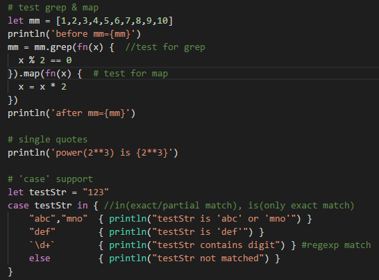

# Syntax Support for VS Code(vsc)

This file provides Syntax highlighting support for the billing Language in `Vs Code`

## VS Code screenshot

## Installation for vsc

Just copy `bs` directory to vsc's extension directory.
e.g. in my computer, it's `${HOME}\.vscode\extensions`

## Known Issues

The same builtin reversed keywords(e.g. `println`) is not correctly
highlighted.